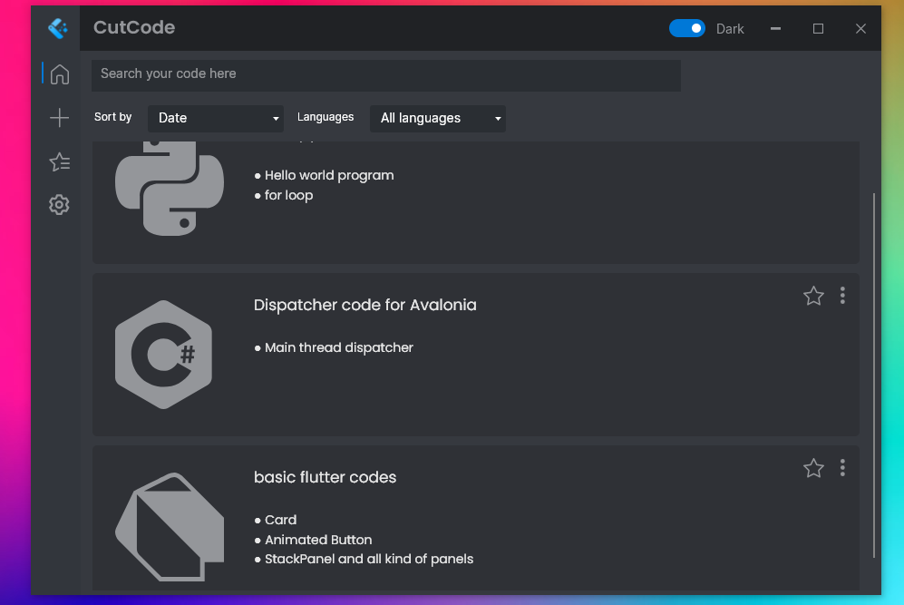
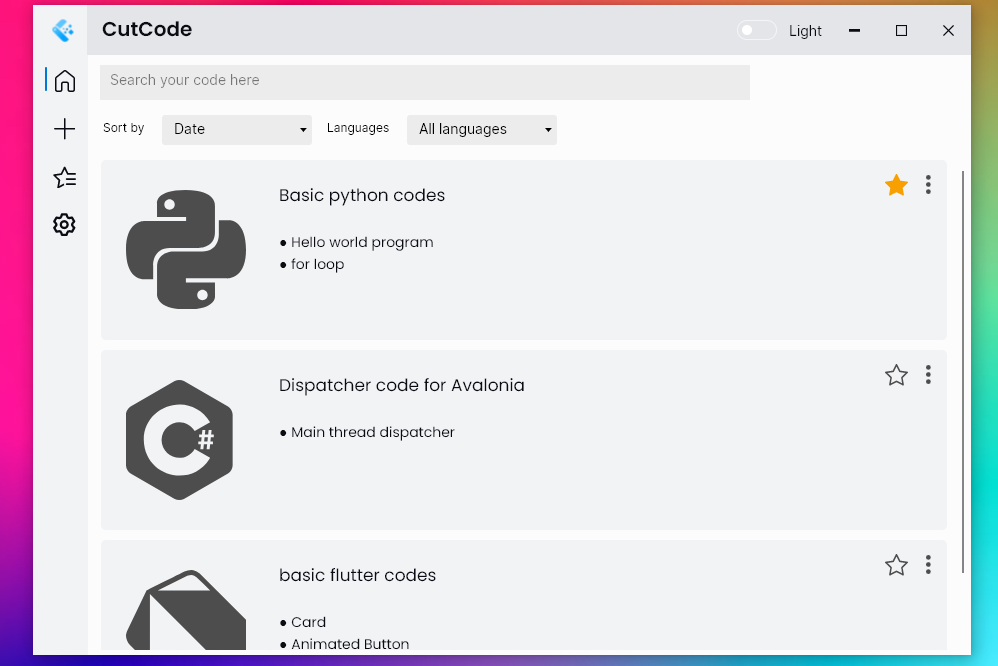
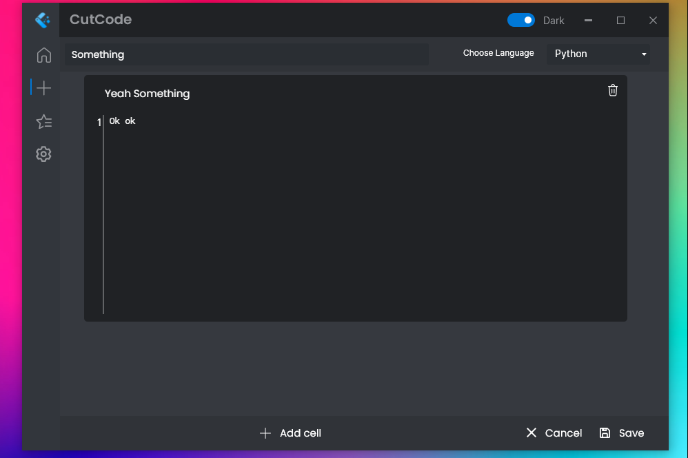
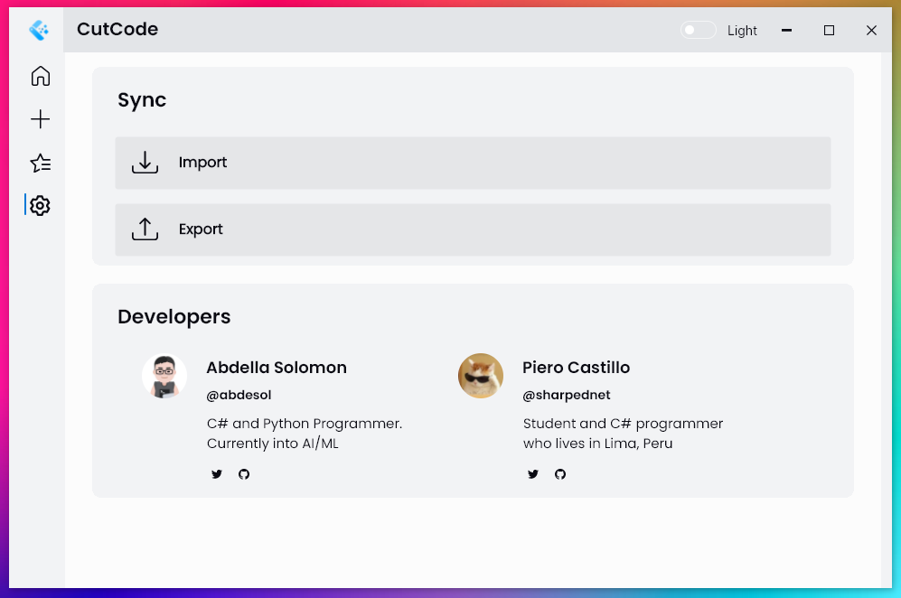
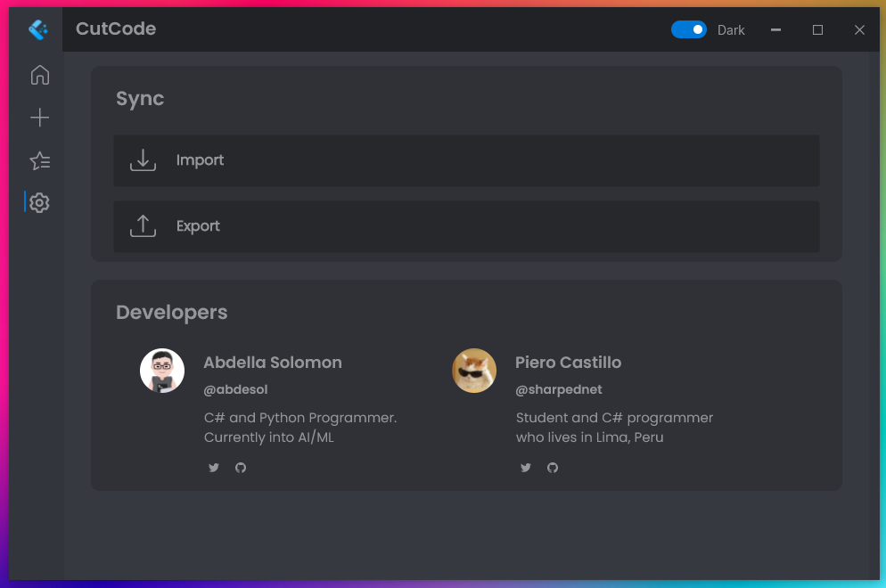
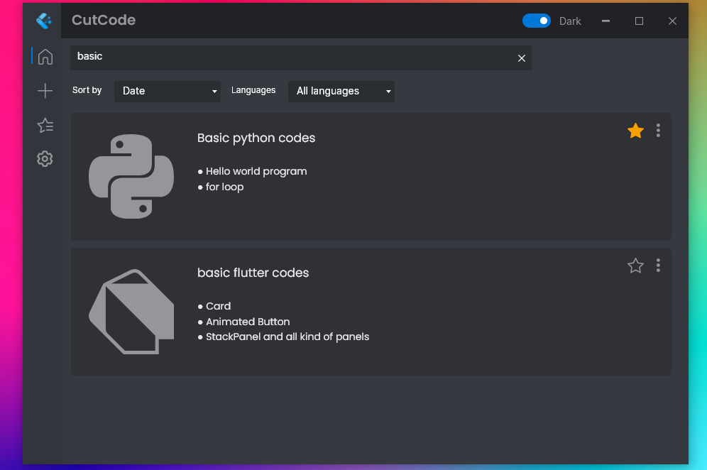
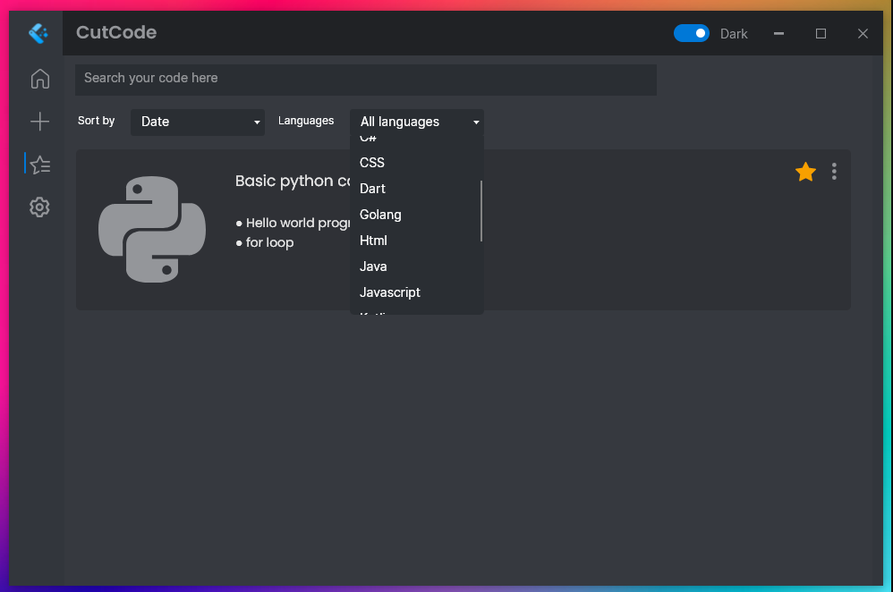

# CutCode

As a developer, we often search on <strong>Google</strong> / <strong>StackOverFlow</strong> for doubts, issues related to our code and our projects, when programming. As a result, we visit a lot of different posts, even different websites to find the right solution to our problem, but many times when we see a proper solution to your problem, we tend to forget where we found it. Hence, we decided to create a tool to help us remember and save our solutions, so that we never forget about it and access it whenever we need it.

<b>CutCode</b> is an open source tool made for developers to boost their productivity and save time by helping them save essential code as code snippets in safe place. These code snippets can be searched and accessed at anytime. It is a very helpful tool as you no longer need to remember your solutions and where you originally found them. Here is a video showcasing how <strong>CutCode</strong> works:

# Appearance 🎨

 
    
    

    
    

    
    

 
    
    

# Features ✨

1. Dark and Light mode support. Just use Dark mode to get a more comfortable experience.
2. Your code snippets are saved in a database, in your system.
3. You can give your code snippets title, description, and also you can add them to your favourite codes list.
4. You can add cells into your code so that you can manage your code snippets easily.
5. You can search through your snippets.
6. Very easy to use and Minimalistic UI and design, which is very user-friendly.
7. Syntax highlighting based on the type of programming language(Coming soon).
8. You can import and export your code from your system and save them as snippets.

# Release 🚀
### [Windows](https://www.google.com)  
### [Linux](https://www.google.com)  
### [MacOS](https://www.google.com)

# Contributors

Main Contributors - [Abdella Solomon](https://github.com/Abdesol), [Piero Castillo](https://github.com/PieroCastillo/)
 
Logo Designer - [Sap](https://github.com/imsaptarshi)

# Credits
This project is entirely open-source and hence, it is completely free to use. However, if you are inspired from this project and have used it in your own project, please consider giving a credits to us.
Thank you, for using CutCode!
Have a nice day!

# Additional 

Connect with me on [GitHub](https://github.com/Abdesol) and [Twitter](https://twitter.com/AbdellaSolomon).
 
Star and share this project with your programmer friends.
 
And make sure to follow me on GitHub to get updated quick :)
