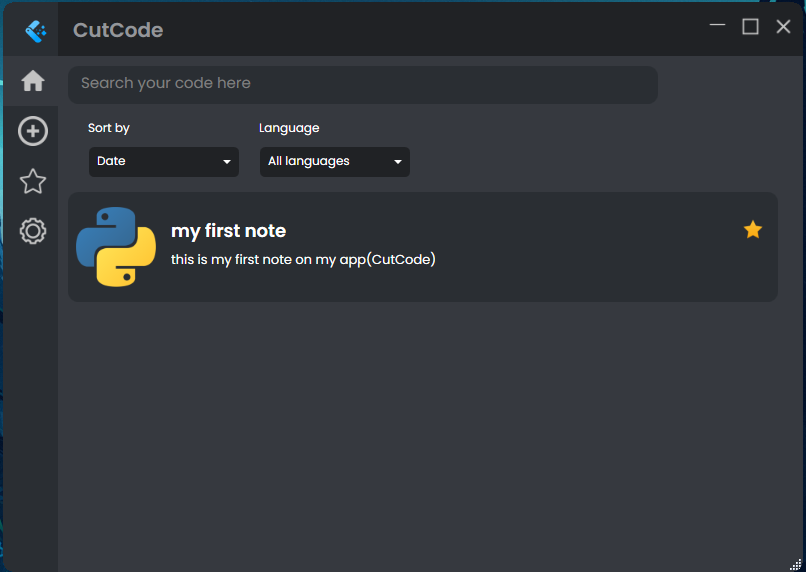
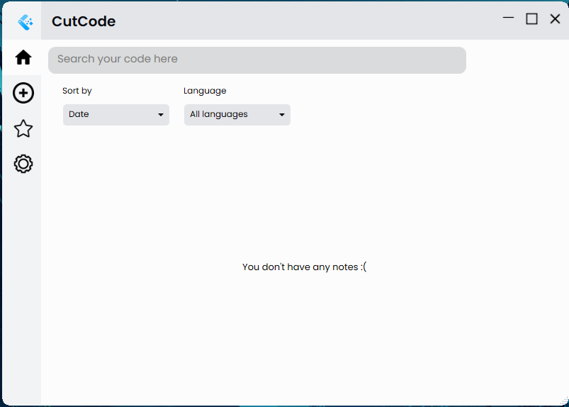
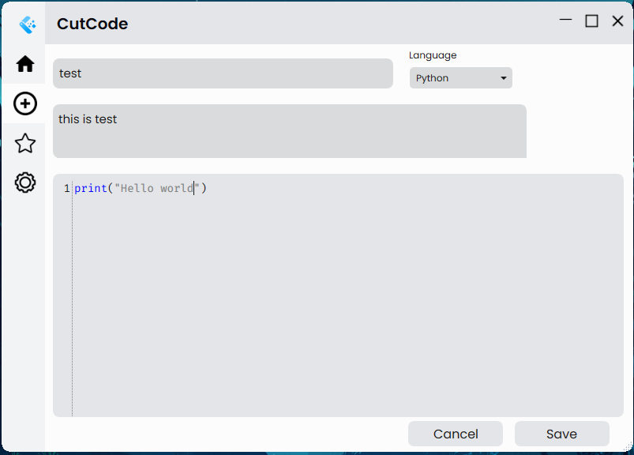
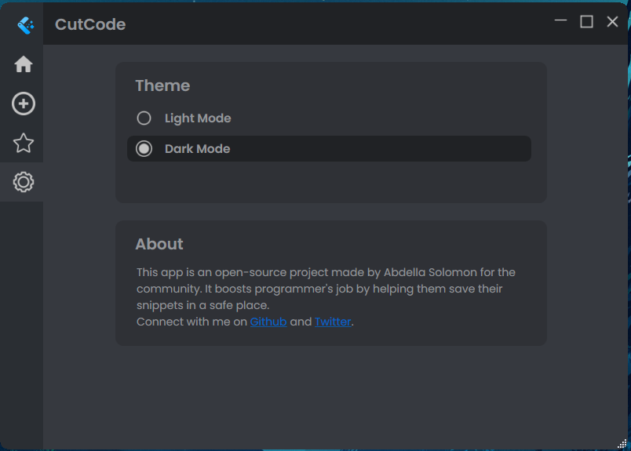
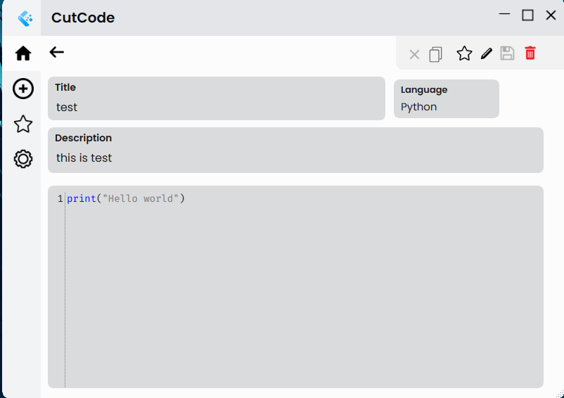
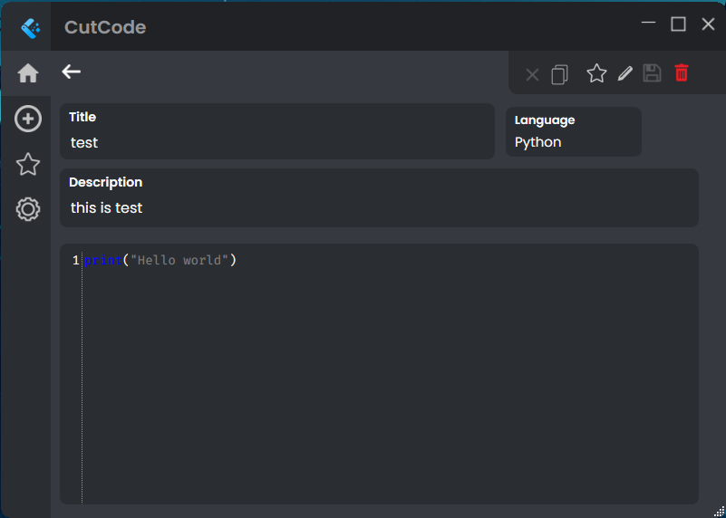

# CutCode - boost your job programmer!
 

 
 

CutCode is an open source project made for developers to boost their job by helping them save essential code snippets in safe place. 
  
Forexample, sometimes as a developer, we need to type one code snippets in most of our projects and for doing that we go check previous projects and grab the code from there. But using this app, you can get all this essential code snippets in one place. You can search through your codes, you can give them title and description. And also you can add them to favourite codes so that you can get it quickly from the favourite codes page.

 
 

# Appearance

<b>

 
    
    
    
    

 
    
    
    

 

# Features

1. Dark and Light mode support
2. Codes are saved in a database
3. You can give your code title, description and also you can add them to your favourite codes list.
4. You can search through your code
5. Minimalistic Interface
6. Syntax highlighting based on the type of programming language

# Release
Download the app from [here](https://github.com/Abdesol)

# Contributers

Main Contributer - [Abdella Solomon(Me)](https://github.com/Abdesol)
 
Logo Designer - [Sap](https://github.com/imsaptarshi)

# Additional

Connect with me on [GitHub](https://github.com/Abdesol) and [Twitter](https://twitter.com/AbdellaSolomon).
 
Star and share the project with your programmer friends.
 
And make sure to follow me on github to get updated quick :)
